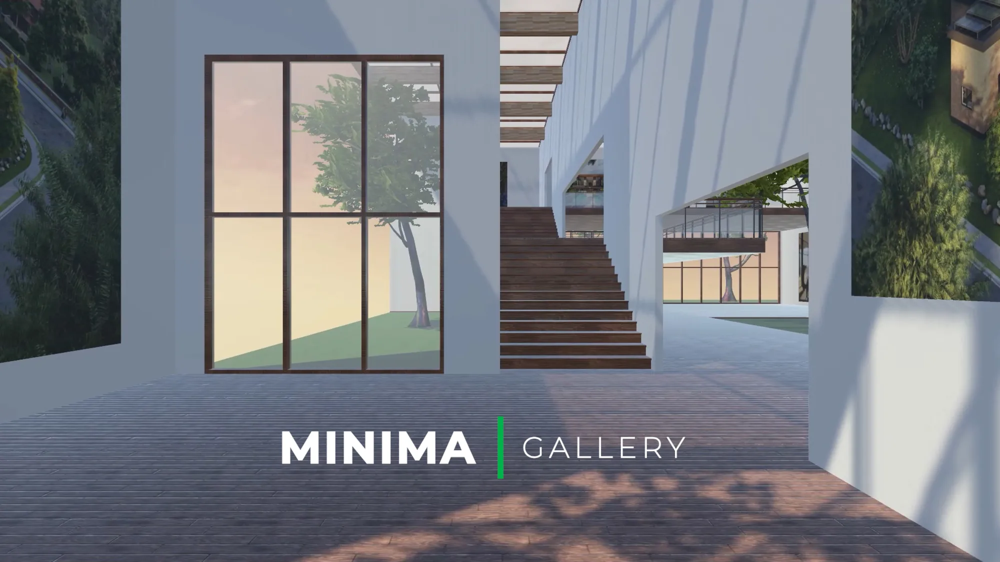

# Galleria - First African MSocialFi Museum tourism for preserving the African heritage through story telling

## Introduction

## Deliverables : Submitted projects should have

### 1. Project / Team name

Galleria-fi

### 2. Short description about the project

Galleria - First African web3 Museum for preserving the African heritage through story telling, As we intend to onboard more web3 users, it is pertinent that the tourism industry of Africa be digitalized. This project seek to bring the blockchain technology into the African tourism (museum) Space. Users from all around the world can tour some of the African heritage without leaving the shores of their country through the power of metaverse. They also buy collectibles as proof of their visit.

### 3. Discord and Telegram username for the team’s person of contact

discord old - holyaustin#3735

discord new - holyaustin

telegram - @holyaustin

twitter (X) : @holyaustin

### 4. Repository with project’s code and demo site

<https://github.com/holyaustin/galleria-fi>

<https://galleria-fi.vercel.app/>

### 5. Video demo (90 seconds) and/or Presentation (10 slides max)

<https://youtu.be/Ti4RCKNeKuA> 

Twitter : https://twitter.com/holyaustin/status/1725279408573862228

### 6. The contract address(es) or website URLs of your deployed application, either on a testnet of your choice or mainnet of a platform of choice

<https://testnet.teloscan.io/address/0xc9637cB5e3EbAEE5124Daa92EA4Fee1Bd37B71FD>

<https://testnet.teloscan.io/address/0x7064f88f4840588b78014d6d3f4556FAAdF20893>

<https://testnet.teloscan.io/address/0xEA9113F3DCAf50541092847095112E76Ba6ceC05>

## Tech Stack Used

Client: Next.js, TailwindCSS, web3.js

web3:  Hardhat, ethers.js, IPFS / Filecoin, XMTP

BlockChain: BSC Testnet

## To run the dapp Locally

1. Clone the repo

2. CD to the directory

3. npm install

4. npm run dev

### npm run dev

Deploying on BSC Testnet / Mainnet

# This command will deploy your smart contract on base testnet

  npx hardhat run scripts/deploy.js --network testnet

<https://dweb.link/ipfs/bafkreiens5gxjvktoyamjtyrzdx3zynp3pqysx4aamjaq7xmoilitwd6v4>   no-return

<https://dweb.link/ipfs/bafkreiaji5ih7pwq4nx5dmzhjwfw23gy74sffw6av77ax5y76n7v3dydcy>    Mirror

<https://dweb.link/ipfs/bafkreifm6dg5eh7hwui3fac2jrewiewcu4e7vm5opwuhwznr3p7n4gsdum>    Iron collar2

<https://dweb.link/ipfs/bafkreid3scqqf2tye6aspnxwbht6yk47llmzrfiwrmvxmahqg42ttpxyye>    hand-neck-chain

<https://dweb.link/ipfs/bafkreidjp2mriqgeaheap2m7o2ypvwj4fb3r3isjtvkdppyiud7z3ek27i>    Chain Girl

<https://dweb.link/ipfs/bafkreigums2o5e7zowjuoincidxvmz77lk7dv2euovxivcgt6lw5pa4pxq>    chained hands

<https://dweb.link/ipfs/bafkreibnfbxjehepfjcsp2ukqve3a22grzi6jl2n3ovtmg56vlo5c3jh44>    xxxxxx

<https://dweb.link/ipfs/bafkreiftew6irumtjaxrwj6ywj2mpbjizrr4kdb5p4yjf3e7i2ulaa4boq>    4 slaves

<https://dweb.link/ipfs/bafkreiazjwjv4xne5ddgw3ffespwnosqrm6ugsgy3fcbiz5e2xch3ygc2e>    Bitcoin Chain
